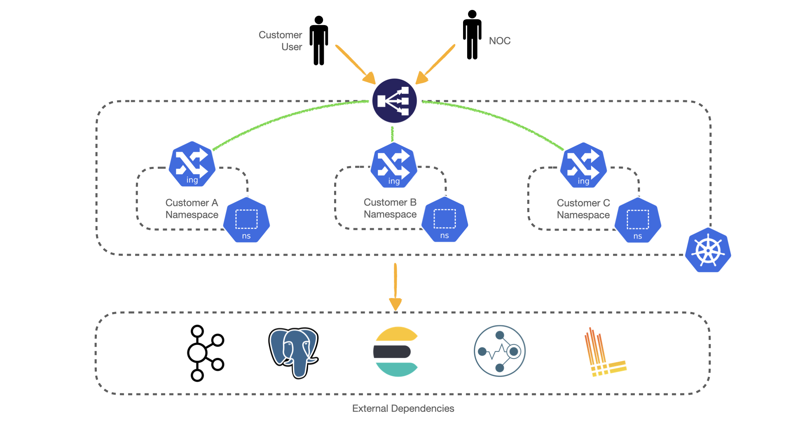
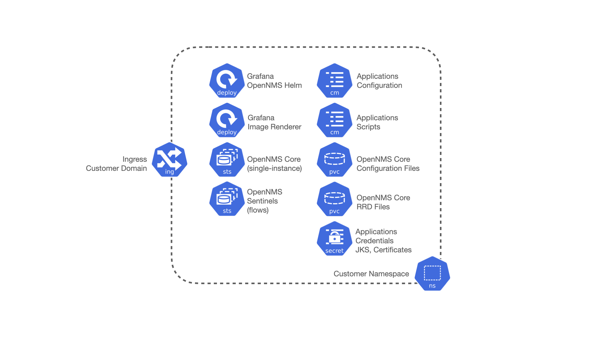

# OpenNMS Helm Charts -- Horizon

OpenNMS Helm Charts makes it easier for users to run OpenNMS Horizon locally in a Kubernetes cluster.
It is not yet available for a Cloud environment.

Each deployment through OpenNMS Helm Charts has a single Core server, Grafana, and a custom Ingress that shares the RRD files and some configuration files, and multiple Sentinels for flow processing.

Note that this is one way to approach the solution.
We recommend that you study the content of the Helm chart and tune it for your needs.

## Quick Start

You can bring up an instance of OpenNMS for testing using the following commands:

```
helm upgrade --install ingress-nginx ingress-nginx \
  --repo https://kubernetes.github.io/ingress-nginx \
  --namespace ingress-nginx --create-namespace

cd scripts

./start-dependencies.sh        

helm repo add opennms https://opennms.github.io/helm-charts

helm install monms opennms/horizon --set domain=domain1.com  --create-namespace
```

## Architecture

The following illustrates the general architecture for the OpenNMS Helm Charts solution, with a Kubernetes container environment, ingress controller, and three unique namespaces.
It also displays external dependencies: Loki, PostgreSQL, Elasticsearch, Kafka, and Cortex.
For more detailed information on Kubernetes and containerized environments, see the [Kubernetes documentation](https://kubernetes.io/docs/home/).

### General architecture



### Customer namespace deployment



Deployment in each namespace includes OpenNMS Horizon Core, OpenNMS Sentinel, Grafana, and application scripts and configuration files.
All components on a single `namespace` represent a single OpenNMS environment or customer deployment or a single tenant.
The name of the `namespace` is used as follows:

* A customer/deployment identifier.
* The name of the deployed Helm application.
* A prefix for the OpenNMS and Grafana databases in PostgreSQL.
* A prefix for the index names in Elasticsearch when processing flows.
* A prefix for the topics in Kafka (requires configuring the OpenNMS instance ID on Minions).
* A prefix for the Consumer Group IDs in OpenNMS and Sentinel.
* Part of the subdomain used by the Ingress Controller to expose Web UIs.

## Design

The solution is based and tested against the latest Horizon.
It is not available for Meridian at this point, but will be in the future.

### Scripts and core configuration

Due to how the current Docker images were designed and implemented, the solution requires multiple specialized scripts to configure each application properly.
You could build your images and move the logic from the scripts executed via `initContainers` to your custom entry point script and simplify the Helm Chart.

The scripts configure only a certain number of things.
Each deployment would likely need additional configuration, which is the main reason for using a Persistent Volume Claim (PVC) for the configuration directory of the Core OpenNMS instance.

We must place the core configuration on a PVC configured as `ReadWriteMany` to allow the use of independent UI servers so that the Core can make changes and the UI instances can read from them.
One advantage of configuring that volume is allowing backups and access to the files without accessing the OpenNMS instances running in Kubernetes.

### Time series databases

Similarly, when using RRDtool instead of Newts/Cassandra or Cortex, a shared volume with `ReadWriteMany` is required for the same reasons (the Core would be writing to it, and the UI servers would be reading from it).
Additionally, when switching strategies and migration are required, you could work outside Kubernetes.

Note that the volumes would still be configured that way even if you decide not to use UI instances, unless you modify the logic of the Helm Chart.

### Scaling

To alleviate load from OpenNMS, you can optionally start Sentinel instances for flow processing.
That requires having an Elasticsearch cluster available.
When Sentinels are present, Telemetryd is disabled in OpenNMS.

The OpenNMS Core and Sentinels are backed by a `StatefulSet` but keep in mind that there can be one and only one Core instance.
To have multiple Sentinels, make sure you have enough partitions for the flow topics in your Kafka clusters, as all of them would be part of the same consumer group.

### Log files and Grafana Loki

The current OpenNMS instances are not friendly when accessing log files.
The Helm Chart allows you to configure [Grafana Loki](https://grafana.com/oss/loki/) to centralize all the log messages.
When the Loki server is configured, the Core instance, the UI instances, and the Sentinel instances will forward logs to Loki.
The current solution employs the sidecar pattern using [Grafana Promtail](https://grafana.com/docs/loki/latest/clients/promtail/) to deliver the logs.

### Docker images

You can customize all of the Docker images via Helm Values.
The solution lets you configure custom Docker registries to access your custom images, or when all the images you plan to use will not be in Docker Hub or when your Kubernetes cluster will not have internet access.
Keep in mind that your custom images should be based on those currently in use.

### Plugins

Containers are bundled with default plugins. Additional plugins can be added by building your own container image (see [kar-container](kar-container/README.md) for an example).

### External dependencies

The Helm Chart assumes that all external dependencies are running somewhere else.
None of them would be initialized or maintained here.
Those are Loki, PostgreSQL, Elasticsearch, Kafka, and Cortex (when applied).
The solution provides a script to start up a set of dependencies for testing as a part of the same cluster but **this is not intended for production use.**

## Product documentation
For information on requirements, installation, manual configuration, and troubleshooting tips, see the [product documentation](https://docs.opennms.com/opennmshelmcharts/latest/installation/introduction.html#requirements).

## Problems/Limitations

When using Newts, the resource cache will not exist on the UI servers (maintained by Collectd), meaning all requests will hit Cassandra, slowing down the graph generation.

## Version compatibility

| Helm chart version | Horizon version(s) | Meridian version(s) |
| ----------- | ----------- | ----------- |
| 1.x | Horizon 32.x | Meridian 2023.x |

## Values

| Key | Type | Default | Description |
|-----|------|---------|-------------|
| core.configuration.affinity | string | `nil` |  |
| core.configuration.alecImage | object | `{}` |  |
| core.configuration.alwaysRollDeployment | bool | `true` |  |
| core.configuration.cortexTssImage | object | `{}` |  |
| core.configuration.database.password | string | `"` |  |
| core.configuration.database.poolSize | int | `50` |  |
| core.configuration.database.username | string | `"opennms"` |  |
| core.configuration.enableAcls | bool | `false` |  |
| core.configuration.enableAlec | bool | `false` |  |
| core.configuration.enableCortex | bool | `false` |  |
| core.configuration.enableTssDualWrite | bool | `false` |  |
| core.configuration.etcUpdatePolicy | string | `"newer"` |  |
| core.configuration.http.adminPassword | string | `""` |  |
| core.configuration.http.restPassword | string | `""` |  |
| core.configuration.http.restUsername | string | `"opennms"` |  |
| core.configuration.nodeSelector | string | `nil` |  |
| core.configuration.rras[0] | string | `"RRA:AVERAGE:0.5:1:2016"` |  |
| core.configuration.rras[1] | string | `"RRA:AVERAGE:0.5:12:1488"` |  |
| core.configuration.rras[2] | string | `"RRA:AVERAGE:0.5:288:366"` |  |
| core.configuration.rras[3] | string | `"RRA:MAX:0.5:288:366"` |  |
| core.configuration.rras[4] | string | `"RRA:MIN:0.5:288:366"` |  |
| core.configuration.storage.etc | string | `"1Gi"` |  |
| core.configuration.storage.mibs | string | `nil` |  |
| core.configuration.storage.rrd | string | `"1000Gi"` |  |
| core.configuration.tolerations | string | `nil` |  |
| core.image.pullPolicy | string | `"IfNotPresent"` |  |
| core.image.repository | string | `"opennms/horizon"` |  |
| core.image.tag | string | `""` |  |
| core.inspector.enabled | bool | `false` |  |
| core.postConfigJob.ttlSecondsAfterFinished | int | `300` |  |
| core.resources.limits.cpu | string | `"2"` |  |
| core.resources.limits.memory | string | `"8Gi"` |  |
| core.resources.requests.cpu | string | `"2"` |  |
| core.resources.requests.memory | string | `"4Gi"` |  |
| core.terminationGracePeriodSeconds | int | `120` |  |
| createNamespace | bool | `true` |  |
| dependencies.cortex.bulkheadMaxWaitDuration | string | `"9223372036854775807"` |  |
| dependencies.cortex.externalTagsCacheSize | int | `1000` |  |
| dependencies.cortex.maxConcurrentHttpConnections | int | `100` |  |
| dependencies.cortex.metricCacheSize | int | `1000` |  |
| dependencies.cortex.readTimeoutInMs | int | `1000` |  |
| dependencies.cortex.readUrl | string | `"http://cortex-query-frontend.shared.svc.cluster.local:8080/prometheus/api/v1"` |  |
| dependencies.cortex.writeTimeoutInMs | int | `1000` |  |
| dependencies.cortex.writeUrl | string | `"http://cortex-distributor.shared.svc.cluster.local:8080/api/v1/push"` |  |
| dependencies.elasticsearch.hosts | object | `{}` |  |
| dependencies.elasticsearch.configuration.flows.enabled | bool | `false` |  |
| dependencies.elasticsearch.configuration.flows.config[0] | string | `elasticIndexStrategy=daily` |  |
| dependencies.elasticsearch.configuration.flows.config[1] | string | `settings.index.number_of_replicas=0` |  |
| dependencies.elasticsearch.configuration.flows.config[2] | string | `settings.index.number_of_shards=1` |  |
| dependencies.elasticsearch.configuration.alarms.enabled | bool | `false` |  |
| dependencies.elasticsearch.configuration.alarms.config[0] | string | `settings.index.number_of_replicas=0` |  |
| dependencies.elasticsearch.configuration.alarms.config[1] | string | `settings.index.number_of_shards=1` |  |
| dependencies.kafka.configuration.saslMechanism | string | `"SCRAM-SHA-512"` |  |
| dependencies.kafka.configuration.securityProtocol | string | `"SASL_SSL"` |  |
| dependencies.kafka.hostname | string | `""` |  |
| dependencies.kafka.password | string | `""` |  |
| dependencies.kafka.port | int | `9093` |  |
| dependencies.kafka.username | string | `"opennms"` |  |
| dependencies.loki.caCert | string | `""` |  |
| dependencies.loki.hostname | string | `""` |  |
| dependencies.loki.password | string | `""` |  |
| dependencies.loki.port | int | `3100` |  |
| dependencies.loki.username | string | `""` |  |
| dependencies.postgresql.caCert | string | `""` |  |
| dependencies.postgresql.hostname | string | `"onms-db.shared.svc"` |  |
| dependencies.postgresql.password | string | `""` |  |
| dependencies.postgresql.port | int | `5432` |  |
| dependencies.postgresql.sslfactory | string | `"org.postgresql.ssl.LibPQFactory"` |  |
| dependencies.postgresql.sslmode | string | `"require"` |  |
| dependencies.postgresql.username | string | `"postgres"` |  |
| dependencies.truststore.content | string | `""` |  |
| dependencies.truststore.password | string | `""` |  |
| domain | string | `"example.com"` |  |
| grafana.configuration.database.image.pullPolicy | string | `"IfNotPresent"` |  |
| grafana.configuration.database.image.repository | string | `"postgres"` |  |
| grafana.configuration.database.image.tag | string | `"13"` |  |
| grafana.configuration.database.password | string | `""` |  |
| grafana.configuration.database.sslmode | string | `"require"` |  |
| grafana.configuration.database.username | string | `"grafana"` |  |
| grafana.configuration.ui.adminPassword | string | `""` |  |
| grafana.image.pullPolicy | string | `"IfNotPresent"` |  |
| grafana.image.repository | string | `"opennms/helm"` |  |
| grafana.image.tag | string | `"9.0.4"` |  |
| grafana.imageRenderer.image.pullPolicy | string | `"IfNotPresent"` |  |
| grafana.imageRenderer.image.repository | string | `"grafana/grafana-image-renderer"` |  |
| grafana.imageRenderer.image.tag | string | `"latest"` |  |
| grafana.imageRenderer.replicaCount | int | `2` |  |
| grafana.imageRenderer.resources.limits.cpu | string | `"200m"` |  |
| grafana.imageRenderer.resources.limits.memory | string | `"256Mi"` |  |
| grafana.imageRenderer.resources.requests.cpu | string | `"100m"` |  |
| grafana.imageRenderer.resources.requests.memory | string | `"128Mi"` |  |
| grafana.replicaCount | int | `0` |  |
| grafana.resources.limits.cpu | string | `"200m"` |  |
| grafana.resources.limits.memory | string | `"256Mi"` |  |
| grafana.resources.requests.cpu | string | `"100m"` |  |
| grafana.resources.requests.memory | string | `"128Mi"` |  |
| imagePullSecrets | list | `[]` |  |
| ingress.annotations | object | `{}` |  |
| ingress.certManager.clusterIssuer | string | `"opennms-issuer"` |  |
| ingress.className | string | `"nginx"` |  |
| promtail.image.pullPolicy | string | `"IfNotPresent"` |  |
| promtail.image.repository | string | `"grafana/promtail"` |  |
| promtail.image.tag | string | `"latest"` |  |
| promtail.resources.limits.cpu | string | `"50m"` |  |
| promtail.resources.limits.memory | string | `"64Mi"` |  |
| sentinel.configuration.database.poolSize | int | `25` |  |
| sentinel.image.pullPolicy | string | `"IfNotPresent"` |  |
| sentinel.image.repository | string | `"opennms/sentinel"` |  |
| sentinel.image.tag | string | `""` |  |
| sentinel.replicaCount | int | `0` |  |
| sentinel.resources.limits.cpu | string | `"2"` |  |
| sentinel.resources.limits.memory | string | `"4Gi"` |  |
| sentinel.resources.requests.cpu | string | `"2"` |  |
| sentinel.resources.requests.memory | string | `"2Gi"` |  |
| sentinel.terminationGracePeriodSeconds | int | `60` |  |
| timezone | string | `"America/New_York"` |  |
